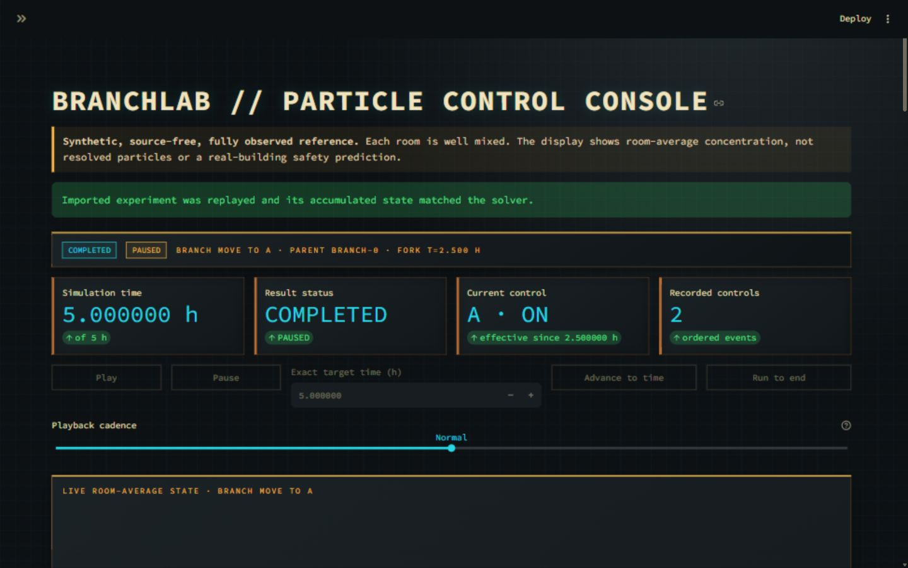

# BranchLab — Observe, Infer, Intervene

BranchLab asks: when only part of a network can be observed, can its hidden state be inferred well enough to choose useful interventions, and when does that approach fail?

The repository currently implements the deterministic full-state reference for that broader research direction. One removable particle class moves through three connected, well-mixed rooms, and one air cleaner can be operated and relocated over a 1-hour or 5-hour horizon. Every state and parameter is known. A fixed experiment exhaustively compares nine predetermined active schedules with a no-cleaner reference, while a local dashboard supports timestamped controls, pause/playback, exact advancement, named forks, comparisons, and deterministic JSON replay. Observation models, hidden-state inference, learned dynamics, feedback control, and real-building calibration are not yet implemented.

**Read [the particle-world guide](docs/particle-world.md) for the authoritative model, units, assumptions, intervention protocol, evaluation definitions, results, interpretation, and verification map.**

## Current capabilities

- deterministic three-room transport with symmetric exchange, background removal, and piecewise-constant filtration;
- exact matrix-exponential propagation and augmented-state concentration integrals;
- independent evaluation of 40 branches across two initial states, two horizons, and ten schedules;
- interactive on/off and location controls with exact simulation timestamps;
- independent named forks plus validated versioned JSON export/import;
- room-level and mean outcomes in CSV, a readable console table, and a four-panel figure; and
- a local Streamlit and Plotly dashboard with a room schematic, histories, event timeline, rate explanation, and completed-branch comparison.

These capabilities form a reproducible synthetic reference, not a safety model or a prediction for a real building. Current implementation status and limitations are tracked in [STATUS.md](STATUS.md).

## Run it from a fresh clone

BranchLab requires Python 3.11 or newer. The `ui` extra installs Streamlit and Plotly in addition to the core numerical and plotting dependencies. The commands below create an isolated environment, install the complete local dashboard, reproduce the fixed outputs, and run all tests.

### Windows PowerShell

```powershell
git clone https://github.com/Foamyfsky/BranchLab.git
Set-Location BranchLab
py -3 -m venv .venv
.\.venv\Scripts\python.exe -m pip install --upgrade pip
.\.venv\Scripts\python.exe -m pip install -e ".[ui]"
.\.venv\Scripts\python.exe -m branchlab.experiment
.\.venv\Scripts\python.exe -m unittest discover -s tests -v
```

If `py -3` is unavailable, use any installed Python 3.11-or-newer executable for the `-m venv .venv` step. The machine used for the current verification also provides this local-only fallback; it is not a portable project requirement:

```powershell
& 'C:\Users\22246\.cache\codex-runtimes\codex-primary-runtime\dependencies\python\python.exe' -m venv .venv
```

### macOS or Linux

```bash
git clone https://github.com/Foamyfsky/BranchLab.git
cd BranchLab
python3 -m venv .venv
./.venv/bin/python -m pip install --upgrade pip
./.venv/bin/python -m pip install -e ".[ui]"
./.venv/bin/python -m branchlab.experiment
./.venv/bin/python -m unittest discover -s tests -v
```

The experiment replaces `results/transport.csv` and `results/transport.png` on every run. The CSV retains both initial states and all 40 deterministic branch records; the figure presents the `(2, 2, 2.5)` µg/m³ case at both horizons.

Install only the core fixed experiment with `python -m pip install -e .` if the dashboard is not needed.

## Launch the interactive dashboard

From the repository root on Windows:

```powershell
.\.venv\Scripts\python.exe -m streamlit run app.py
```

On macOS or Linux, use `./.venv/bin/python -m streamlit run app.py`.

A short walkthrough:

1. Create or keep the `(2, 2, 2.5)` µg/m³, 5-hour scenario with the cleaner on in C.
2. Enter `2.5` as the exact target time and advance while paused.
3. Create a named fork. Finish the parent in C, then select the child, apply A/on at 2.5 h, and finish it.
4. Compare completed losses, room integrals, final concentrations, and actual clean-air volumes.
5. Download the versioned JSON, upload it, and press **Import and replay JSON** to validate and restore the same branches.

Changing initial conditions or horizon does not silently mutate an experiment; press **Create new experiment** explicitly. Playback cadence changes only wall-clock refresh timing, not the timestamped physical solution.



## Representative result

For the `(2, 2, 2.5)` µg/m³ initial state, fixed placement is horizon dependent. At 1 hour, C→C is the best of the three fixed placements, while C→A is best among the nine tested two-half schedules. At 5 hours, B→B is the best fixed placement, while C→A remains best among the nine tested schedules.

| Horizon | No-cleaner J | Best fixed | Best of nine tested |
| --- | ---: | --- | --- |
| 1 h | 2.06185594 | C→C: 1.77332755 | C→A: 1.75913460 |
| 5 h | 8.52516904 | B→B: 5.21845964 | C→A: 5.07003394 |

`J` is integrated mean concentration in µg·h/m³; lower is better. See the [world guide's evaluation and interpretation](docs/particle-world.md#evaluation) for denominators, room-level results, equal-budget reasoning, relocation comparisons, and limits.


