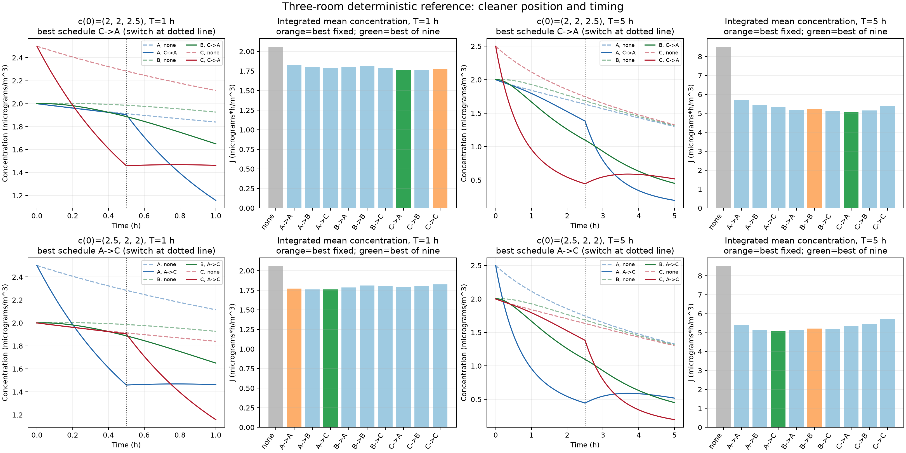

# BranchLab — Three-room transport reference

BranchLab currently provides a small deterministic full-state reference experiment: one removable particle class moves through three connected, well-mixed rooms, while one air cleaner can be placed in a different room during each half of the experiment. It compares interventions under known synthetic conditions; it does not yet infer hidden state, predict a real building, or establish safety.

## Scene and mass balance

The rooms form the path A–B–C. For room `i`, the implemented balance is

```text
V_i dc_i/dt = sum_j q_ij (c_j - c_i) - (k_i V_i + u_i(t)) c_i
```

`c_i` is concentration in micrograms/m³ and time is in hours. `V_i` is room volume in m³, symmetric `q_ij` is inter-room exchange in m³/hour, `k_i` is background removal per hour, and `u_i(t)` is equivalent clean-air delivery in m³/hour. Symmetric exchange cancels when the three room mass balances are summed; background removal and the cleaner are the only sinks. There is no continuing source after the initial release.

The synthetic example uses:

- `V = (100, 100, 100)` m³;
- `q_AB = q_BA = q_BC = q_CB = 50` m³/hour, with no A–C exchange;
- `k = (0.1, 0.1, 0.1)` per hour;
- one 100 m³/hour cleaner;
- initial states `(2, 2, 2.5)` and `(2.5, 2, 2)` micrograms/m³; and
- horizons of 1 and 5 hours.

Equal volumes and symmetric exchange isolate position and horizon effects. The assumptions are well-mixed rooms, fixed exchange, constant cleaner performance, negligible relocation time at the halfway point, and a single particle class with linear removal. These inputs are examples, not measurements or calibrated building data.

Multizone contaminant models commonly use well-mixed zones; the cited NIST discussion of CONTAM also describes why a more detailed CFD zone may be needed when that assumption is too broad: [Wang, Dols, and Chen (2010), NIST](https://www.nist.gov/publications/using-cfd-capabilities-contam-30-simulating-airflow-and-contaminant-transport-and).

## Experiment and objective

Every active branch starts from the same initial state and runs the same cleaner capacity for the full horizon. The cleaner is assigned to any of A, B, or C for the first half, then independently to any room for the second half, giving nine schedules. A separate no-cleaner branch is the reference.

The primary loss is time-integrated mean concentration:

```text
J = integral_0^T mean(c_A, c_B, c_C) dt
```

Its units, and the units of each room's integrated concentration, are micrograms·hour/m³. Lower is better. Absolute and percentage improvements are reported relative to the matching no-cleaner branch. `src/branchlab/transport.py` propagates both concentration and cumulative concentration with `scipy.linalg.expm` on an augmented linear system, so the scores do not depend on plotting resolution.

## Run and verify

From the repository root in PowerShell, using the repository virtual environment:

```powershell
.\.venv\Scripts\python.exe -m pip install -e .
.\.venv\Scripts\python.exe -m branchlab.experiment
.\.venv\Scripts\python.exe -m unittest discover -s tests -v
git diff --check
```

Re-running the experiment replaces `results/transport.csv` and `results/transport.png`. The console table and CSV keep the two initial states and two horizons separate. The test suite checks exchange-only mass conservation, isolated analytic decay, nonnegative concentrations, equal active budgets, independent branch inputs, mirror symmetry under swapping A and C, and the supplied independent fixed-placement reference values.



## Interpretation and limits

The generated results are:

| Initial state (micrograms/m³) | Horizon | No-cleaner J | Best fixed placement | Best of nine schedules |
| --- | ---: | ---: | --- | --- |
| `(2, 2, 2.5)` | 1 h | 2.06185594 | C→C, 1.77332755 (13.99% better) | C→A, 1.75913460 (14.68% better) |
| `(2, 2, 2.5)` | 5 h | 8.52516904 | B→B, 5.21845964 (38.79% better) | C→A, 5.07003394 (40.53% better) |
| `(2.5, 2, 2)` | 1 h | 2.06185594 | A→A, 1.77332755 (13.99% better) | A→C, 1.75913460 (14.68% better) |
| `(2.5, 2, 2)` | 5 h | 8.52516904 | B→B, 5.21845964 (38.79% better) | A→C, 5.07003394 (40.53% better) |

This controlled reference establishes that cleaner location and timing interact with transport. For fixed placement, the initially higher end room is best over 1 hour, while the central room is best over 5 hours because it exchanges directly with both neighbors. The best relocated schedule first cleans the initially higher end room and then the opposite end: after the first half, removal and exchange have changed which room contributes most to future total exposure. The mirror results are identical after swapping A and C, as the symmetric geometry requires. The experiment quantifies these effects only for the stated linear, fully observed synthetic system.

Current capability is deterministic forward simulation and exhaustive comparison of the ten stated branches. It has no observations, state inference, uncertainty model, measured provenance, continuing emissions, nonlinear removal, airflow estimation, or safety threshold. Results should therefore be treated as verified reference calculations for future research code, not as operational building guidance.
